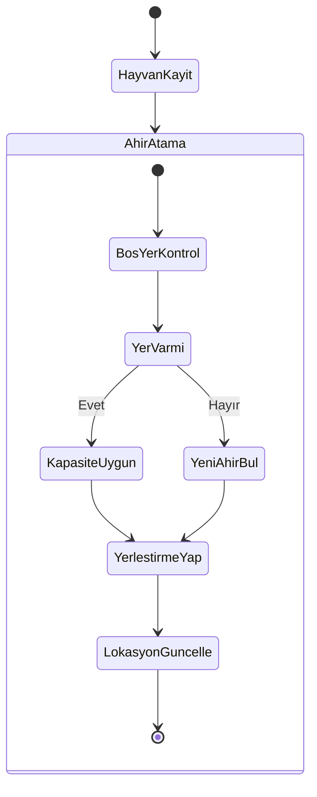
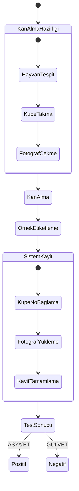

# Hayvancılık Yönetim Sistemi - Sistem Mimarisi

[Previous sections remain unchanged until Database Schema]

## 3. Veritabanı Şeması

```sql
-- Önceki tablolar aynı kalacak, yeni tablolar ekleniyor

-- Ahır/Padok yönetimi için
CREATE TABLE locations (
    id UUID DEFAULT uuid_generate_v4() PRIMARY KEY,
    name VARCHAR(100) NOT NULL,
    type VARCHAR(20) CHECK (type IN ('AHIR', 'PADOK')),
    capacity INTEGER,
    status VARCHAR(20) DEFAULT 'AKTIF',
    notes TEXT,
    created_at TIMESTAMPTZ DEFAULT NOW(),
    updated_at TIMESTAMPTZ DEFAULT NOW()
);

-- Hayvan lokasyon geçmişi
CREATE TABLE animal_locations (
    id UUID DEFAULT uuid_generate_v4() PRIMARY KEY,
    animal_id UUID REFERENCES animals(id),
    location_id UUID REFERENCES locations(id),
    start_date TIMESTAMPTZ NOT NULL,
    end_date TIMESTAMPTZ,
    notes TEXT,
    created_by UUID REFERENCES user_profiles(id),
    created_at TIMESTAMPTZ DEFAULT NOW(),
    updated_at TIMESTAMPTZ DEFAULT NOW()
);

-- Hayvan tablosuna yeni alanlar ekleniyor
ALTER TABLE animals ADD COLUMN tag_number VARCHAR(50);
ALTER TABLE animals ADD COLUMN blood_test_tag VARCHAR(50);
ALTER TABLE animals ADD COLUMN current_location_id UUID REFERENCES locations(id);
ALTER TABLE animals ADD COLUMN photos JSONB DEFAULT '[]'::jsonb;

-- Kan alma süreci için
CREATE TABLE blood_samples (
    id UUID DEFAULT uuid_generate_v4() PRIMARY KEY,
    animal_id UUID REFERENCES animals(id),
    tag_number VARCHAR(50) NOT NULL,
    sample_date TIMESTAMPTZ NOT NULL,
    photo_urls JSONB DEFAULT '[]'::jsonb,
    notes TEXT,
    created_by UUID REFERENCES user_profiles(id),
    created_at TIMESTAMPTZ DEFAULT NOW(),
    updated_at TIMESTAMPTZ DEFAULT NOW()
);

-- İndeksler
CREATE INDEX idx_animal_locations_animal_id ON animal_locations(animal_id);
CREATE INDEX idx_animal_locations_location_id ON animal_locations(location_id);
CREATE INDEX idx_blood_samples_animal_id ON blood_samples(animal_id);
CREATE INDEX idx_blood_samples_tag_number ON blood_samples(tag_number);

-- RLS Politikaları için önceki yapılandırmalar korunacak
ALTER TABLE locations ENABLE ROW LEVEL SECURITY;
ALTER TABLE animal_locations ENABLE ROW LEVEL SECURITY;
ALTER TABLE blood_samples ENABLE ROW LEVEL SECURITY;
```

## 4. İş Akışları

### 4.1 Hayvan Lokasyon Yönetimi



### 4.2 Kan Alma ve Test Süreci



## 5. Geliştirme Öncelikleri

1. Temel Altyapı Geliştirmeleri (2-3 Hafta)
   - Rol tabanlı yetkilendirme sistemi
   - Audit logging mekanizması
   - Veritabanı şema güncellemeleri
   - Ahır/Padok yönetim modülü

2. Yüksek Öncelikli Modüller (3-4 Hafta)
   - Kullanıcı yönetimi ve yetkilendirme arayüzü
   - Hayvan lokasyon takip sistemi
   - Kan alma ve test süreci entegrasyonu
   - Muhasebe modülü

3. Orta Öncelikli Geliştirmeler (2-3 Hafta)
   - Üreme takip sistemi
   - Raporlama sistemi
   - Fotoğraf yükleme ve yönetimi
   - Bildirim mekanizması

4. Düşük Öncelikli İyileştirmeler (1-2 Hafta)
   - UI/UX geliştirmeleri
   - Performans optimizasyonları
   - Mobil uyumluluk
   - Ek analitik özellikleri

[Previous sections remain unchanged]