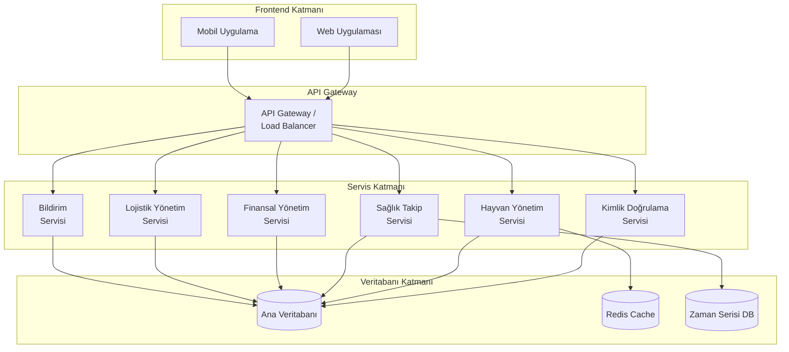
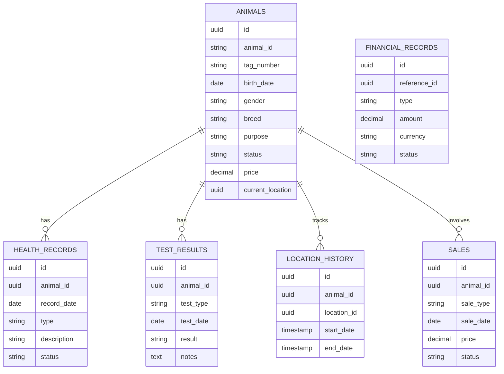
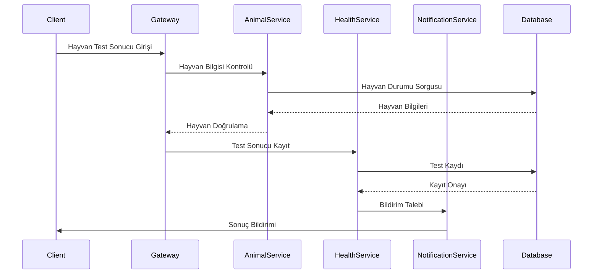
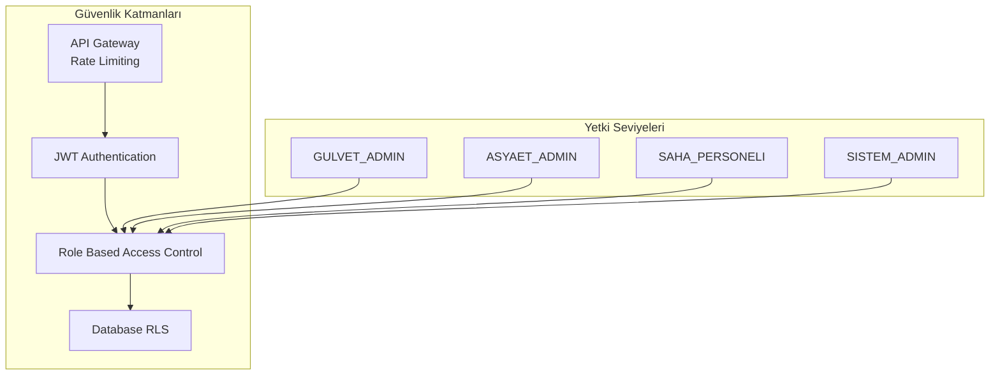
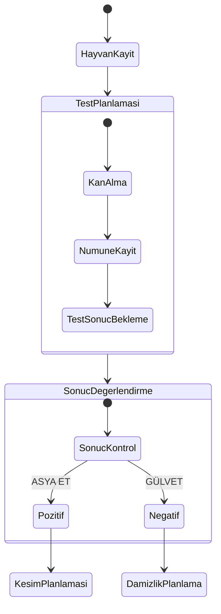
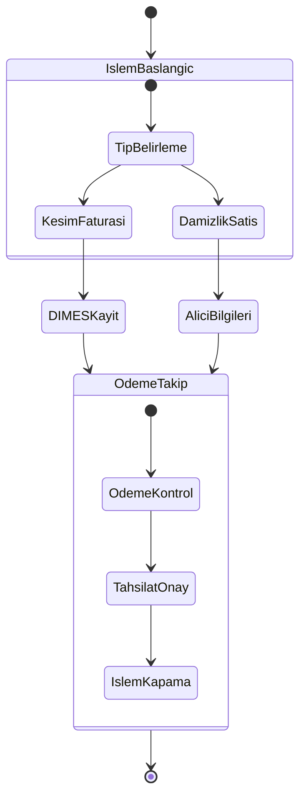

# GLV (GÜLVET-ASYA ET) Hayvancılık Yönetim Sistemi - Sistem Mimarisi

## 1. Sistem Genel Bakışı

GLV, mikroservis mimarisi üzerine kurulu, modern bir hayvancılık yönetim sistemidir. Sistem, GÜLVET ve ASYA ET konsorsiyumunun ihtiyaçlarını karşılamak üzere tasarlanmıştır.

### 1.1 Sistem Mimarisi



### 1.2 Mikroservis Yapılandırması

Her bir servis bağımsız olarak çalışan ve ölçeklenebilen bir mikroservis olarak tasarlanmıştır:

1. **Kimlik Doğrulama Servisi**
   - Kullanıcı yönetimi
   - Rol bazlı yetkilendirme
   - JWT token yönetimi
   - Oturum kontrolü

2. **Hayvan Yönetim Servisi**
   - Hayvan kaydı ve takibi
   - Soy ağacı yönetimi
   - Lokasyon takibi
   - Durum güncellemeleri

3. **Sağlık Takip Servisi**
   - Test sonuçları yönetimi
   - Aşı takibi
   - Sağlık raporları
   - Karantina yönetimi

4. **Finansal Yönetim Servisi**
   - Konsorsiyum muhasebesi
   - DIMES entegrasyonu
   - Ödeme takibi
   - Finansal raporlama

5. **Lojistik Yönetim Servisi**
   - Kesimhane sevkiyat
   - Damızlık satış
   - Stok yönetimi
   - Transfer işlemleri

6. **Bildirim Servisi**
   - Email bildirimleri
   - SMS entegrasyonu
   - Push notifications
   - Alarm yönetimi

## 2. Veri Modeli ve Servis İlişkileri

### 2.1 Veritabanı Şeması



### 2.2 Servis İletişim Modeli



## 3. Güvenlik Katmanı

### 3.1 Güvenlik Mimarisi



### 3.2 Yetkilendirme Matrisi

| Rol | Hayvan Yönetimi | Test Yönetimi | Finansal İşlemler | Sistem Ayarları |
|-----|-----------------|---------------|-------------------|-----------------|
| GULVET_ADMIN | Tam Yetki | Tam Yetki | Kısıtlı | Kısıtlı |
| ASYAET_ADMIN | Tam Yetki | Görüntüleme | Tam Yetki | Kısıtlı |
| SAHA_PERSONELI | Kısıtlı | Veri Giriş | Yok | Yok |
| SISTEM_ADMIN | Tam Yetki | Tam Yetki | Tam Yetki | Tam Yetki |

## 4. İş Akışları

### 4.1 Hayvan Kayıt ve Test Süreci



### 4.2 Finansal İşlem Süreci



## 5. Geliştirme Öncelikleri

### 5.1 Faz 1: Temel Altyapı (4-6 Hafta)
- Mikroservis altyapısının kurulumu
- API Gateway implementasyonu
- Temel güvenlik katmanı
- Veritabanı migrasyonları

### 5.2 Faz 2: Çekirdek Modüller (6-8 Hafta)
- Hayvan yönetim servisi
- Test takip sistemi
- Lokasyon yönetimi
- Kullanıcı yetkilendirme sistemi

### 5.3 Faz 3: Finansal Modüller (4-6 Hafta)
- DIMES entegrasyonu
- Konsorsiyum muhasebesi
- Ödeme takip sistemi
- Finansal raporlama

### 5.4 Faz 4: Operasyonel Modüller (4-6 Hafta)
- Kesimhane entegrasyonu
- Damızlık satış sistemi
- Lojistik yönetimi
- Bildirim sistemi

### 5.5 Faz 5: İyileştirmeler (4-6 Hafta)
- Performans optimizasyonları
- UI/UX geliştirmeleri
- Raporlama sistemi
- Mobil uygulama

## 6. Deployment Mimarisi

```mermaid
graph TB
    subgraph "Production Environment"
        LB[Load Balancer]
        
        subgraph "Service Cluster"
            API1[API Instance 1]
            API2[API Instance 2]
            API3[API Instance 3]
        end
        
        subgraph "Database Cluster"
            DB_Master[(Master DB)]
            DB_Slave1[(Slave DB 1)]
            DB_Slave2[(Slave DB 2)]
        end
        
        subgraph "Cache Layer"
            Redis1[(Redis Primary)]
            Redis2[(Redis Replica)]
        end
        
        subgraph "Monitoring"
            Prometheus[Prometheus]
            Grafana[Grafana]
            ELK[ELK Stack]
        end
    end
    
    LB --> API1
    LB --> API2
    LB --> API3
    
    API1 --> DB_Master
    API2 --> DB_Master
    API3 --> DB_Master
    
    DB_Master --> DB_Slave1
    DB_Master --> DB_Slave2
    
    API1 --> Redis1
    API2 --> Redis1
    API3 --> Redis1
    
    Redis1 --> Redis2
    
    API1 --> Prometheus
    API2 --> Prometheus
    API3 --> Prometheus
    
    Prometheus --> Grafana
    API1 --> ELK
    API2 --> ELK
    API3 --> ELK